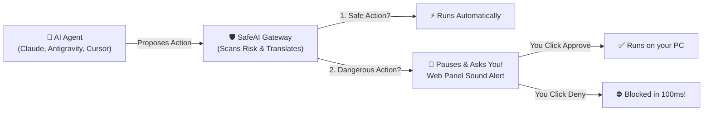

# 🛡️ SafeAI — The AI Agent Bodyguard ("For Dummies" Guide)

> **Think of SafeAI like an airport security checkpoint for your AI agents.**  
> When Claude, Antigravity, Cursor, or ChatGPT wants to run a command on your computer, SafeAI steps in first, checks what it's trying to do, explains it to you in **plain human language** in your chosen language, and asks for your approval if it looks dangerous!

---

## 🛑 Why Do You Need SafeAI?

Autonomous AI coding agents are incredibly smart, but they can make catastrophic mistakes:
- ❌ **Accidental deletions:** An agent might try to run `rm -rf` to "clean up temporary files" and wipe your whole desktop or operating system.
- ❌ **Credential leaks:** An agent might send your private `.env` file, AWS keys, or SSH passwords to an external server.
- ❌ **Complex terminal jargon:** Agents run confusing commands like `cat id_rsa | base64 -d | curl ...`. Unless you're a Linux hacker, it's hard to tell if it's safe or malicious!

### 💡 How SafeAI Protects You



1. **Traffic Light Risk Scoring:** SafeAI scans every command across destruction, secrets access, data theft, and prompt hacks.
2. **"For Dummies" Explainer:** Translates terminal mumbo-jumbo into 1-2 simple sentences in your natural language (English, Turkish, Spanish, German, French, etc.).
3. **Emergency Pause:** If a command is risky, SafeAI freezes the connection and rings a chime on your screen. You click **"Approve"** or **"Deny"**.
4. **Secret Masker (DLP):** Automatically blacks out your passwords, API keys, and tokens so they never get logged in plain text.
5. **100% Local & Private:** Runs entirely on your own computer. No data ever leaves your network.

---

## 🚀 Quickstart: Get Running in 2 Minutes

### Option 1: The Easiest Way (Docker) 🐳

If you have [Docker Desktop](https://www.docker.com/products/docker-desktop/) installed, you can launch everything with one command:

```bash
docker compose -f docker/docker-compose.yml up --build
```

That's it! Open **http://localhost:8080** in your browser to see your dashboard.

---

### Option 2: Running Locally (Without Docker) 💻

If you prefer running it directly on your machine:

#### Step 1: Start the Backend (Terminal 1)
```bash
# 1. Create a virtual environment & install requirements
python3 -m venv .venv
source .venv/bin/activate
pip install -r backend/requirements.txt

# 2. Start the gateway server
uvicorn backend.main:app --host 0.0.0.0 --port 8080 --reload
```

#### Step 2: Start the Web Dashboard (Terminal 2)
```bash
# 1. Install frontend packages
cd frontend
npm install

# 2. Launch live frontend
npm run dev
```

Open **http://localhost:5173** (or **http://localhost:8080** if built) in your web browser.

---

## 🔌 Connect Your AI Agent (One-Click Setup)

SafeAI includes an automatic configuration generator script! Run:

```bash
python scripts/generate_configs.py
```

This creates ready-to-use configuration files inside the `client_configs/` directory.

### 1. Claude Desktop
1. Open Claude Desktop Settings (`Settings` -> `Developer` -> `Edit Config`).
2. Copy the contents of [`client_configs/claude_desktop_config.json`](file:///Users/fuatu/Projects/safeai/client_configs/claude_desktop_config.json):
```json
{
  "mcpServers": {
    "safeai": {
      "command": "npx",
      "args": ["-y", "mcp-remote", "http://localhost:8080/mcp"]
    }
  }
}
```
3. Restart Claude Desktop. Claude is now protected!

### 2. Google Antigravity IDE
Add SafeAI to your workspace `.agents/mcp_config.json` or global config:
```json
{
  "mcpServers": {
    "safeai": {
      "type": "sse",
      "url": "http://localhost:8080/mcp",
      "description": "SafeAI Agent Guard & Explainer"
    }
  }
}
```

### 3. Cursor / Windsurf / OpenAI-compatible Agents
- **MCP Server URL:** `http://localhost:8080/mcp`
- **OpenAI Proxy Base URL:** `http://localhost:8080/v1`
- **API Key:** any string (e.g. `safeai-local-key`)

---

## 🖥️ How to Use the Web Panel

When you open **http://localhost:8080**, you will see:

### 1. The Live Approval Popup
When your AI agent attempts something high-risk, a popup window will immediately appear with a warning chime:
- **Risk Badge:**
  - 🟢 **Green (0 - 49):** Safe actions (runs automatically).
  - 🟡 **Yellow (50 - 69):** Elevated risk (caution advised).
  - 🔴 **Red (70 - 100):** Dangerous action (e.g., deleting folders, reading passwords).
- **Consequence Summary:** Reads like:
  > *"WARNING: This action permanently alters or deletes files and directories on your system."*  
  > Or in Turkish: *"UYARI: Bu işlem sisteminizdeki dosya veya dizinleri kalıcı olarak siler veya değiştirir."*
- **Countdown Clock:** You have 90 seconds to review before SafeAI safely rejects the command.
- **Buttons:** Click **Approve & Execute** to let it run, or **Deny & Abort** to cancel it instantly.

### 2. Explainer View Modes
In the popup or settings, you can switch view modes:
- **Plain Language (Default):** Highlights what happens in everyday words so non-technical users can make an informed choice.
- **Technical:** Shows the exact bash command, script, or payload diff.
- **Off:** Disables plain explanations.

### 3. Settings & Language Customization
Click the **"Policy Settings"** tab at the top right:
- **Human Approval Threshold:** Move the slider (default: `50`). Setting it lower makes SafeAI more cautious; setting it higher makes it more permissive.
- **Active Language:** Set to **"Auto-detect from conversation context & locale"** (or lock to Turkish, German, Spanish, French, or English). When set to auto, SafeAI **automatically detects whether your chat app prompt is in Turkish, German, Spanish, French, or English** and switches explanations on the fly!
- **Approval Timeout Window:** Move the slider from 0 to 300 seconds. Setting it to **`0 seconds` enables ∞ Infinite Hold**, meaning SafeAI will suspend high-risk actions indefinitely until you explicitly click Approve or Deny!
- **MCP Tool Governance:** Configure granular security settings per tool (e.g. `bash`, `read_file`, `web_search`) or set default policy on the **Generic Tool (`*`) fallback**. You can customize thresholds, enable/disable tools, route to custom downstream servers, adjust timeouts, or bypass approval for trusted actions.
- **Deterministic Rules:** Add custom command or path blacklists (e.g. block any command containing `mkfs` or access to `/secrets`).

### 4. Audit Trail & Log Export
- View every action your AI performed in the **Live Activity** tab.
- Click **"Export JSON"** to download a clean log report. All sensitive passwords and API keys are permanently masked as `[REDACTED_*]`.

---

## ❓ Frequently Asked Questions (FAQ)

#### Q: Does SafeAI slow down my AI agent?
**A:** No! SafeAI calculates risk in less than 20 milliseconds. If the action is safe, it runs immediately without perceptible delay.

#### Q: Does my code or data leave my computer?
**A:** **Never.** SafeAI has zero telemetry, no cloud accounts, and no outbound internet dependencies. All logs and rules are stored on your local machine in SQLite.

#### Q: What happens if I step away from my computer?
**A:** By default, SafeAI has a **fail-closed timeout** (e.g. 90 seconds) where unreviewed actions auto-reject. If you prefer actions to wait until you return, slide the **Approval Timeout Window to 0 (∞ Infinite Hold)**!

#### Q: How does conversational language auto-switching work?
**A:** If you start chatting in Turkish (`"Lütfen testleri çalıştır ve dosyaları göster"`), SafeAI detects Turkish and displays the explanation in Turkish. If you switch to German (`"Bitte führe die Tests aus"`), it immediately adapts to German! If the input is ambiguous technical syntax (e.g. `ls -la`), it gracefully falls back to your system locale.

---

## 🧪 Running the Automated Verification Tests

To verify that all security features and tests pass on your machine:

```bash
# Run all 55 automated unit and integration tests
.venv/bin/pytest -v
```

All 55 tests will verify:
- ✅ Sub-200ms AST security risk scoring
- ✅ Automatic password and token redaction (DLP)
- ✅ Conversational language auto-detection (Turkish, German, Spanish, French, English) & locale fallback
- ✅ Human-in-the-Loop asynchronous connection suspension & infinite hold
- ✅ Per-tool MCP routing, custom thresholds, and generic wildcard (`*`) governance
- ✅ SQLite audit logging and disk-space pruning

---

## 📁 Project Structure

```
safeai/
├── backend/                  # Python FastAPI Backend
│   ├── explainer/            # Plain-language multilingual translator
│   ├── gateway/              # MCP (SSE) & OpenAI proxy routers
│   ├── hitl/                 # Human-in-the-loop async hold broker
│   ├── models/               # SQLModel database schemas
│   ├── routes/               # REST API & WebSockets handlers
│   ├── security/             # AST shell analyzer & DLP secret masker
│   └── storage/              # SQLite persistent audit store
├── frontend/                 # React 18 + Vite + Tailwind CSS Dashboard
│   ├── src/components/       # Live Approval Modal, Timeline, Settings
│   └── src/hooks/            # WebSocket connection hook
├── docker/                   # Dockerfile & Docker Compose configs
├── scripts/                  # One-click client configuration generator
└── tests/                    # 45 automated pytest suites
```

---

*SafeAI — Safe, transparent, and comprehensible AI autonomy on your machine.*
